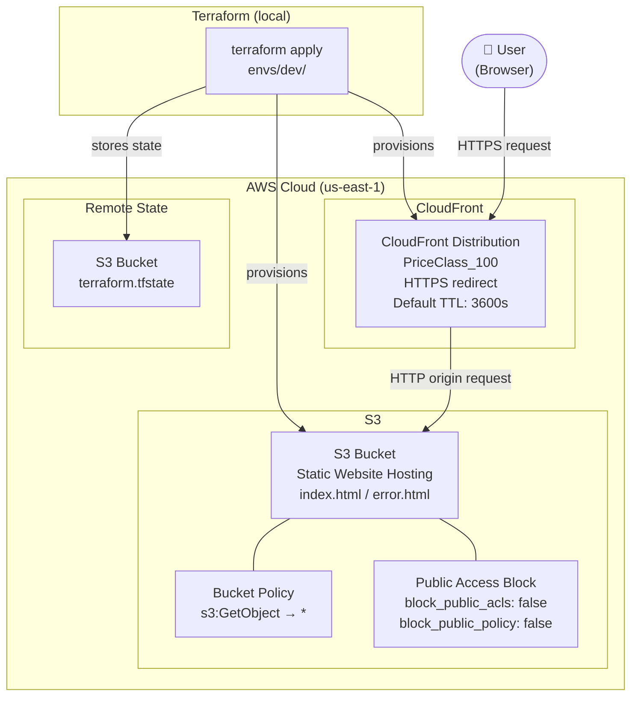

# Day 25 — Architecture Diagram



## Resource Summary

| Resource | Type | Purpose |
|---|---|---|
| `aws_s3_bucket` | S3 | Stores website files |
| `aws_s3_bucket_website_configuration` | S3 | Enables static website hosting |
| `aws_s3_bucket_public_access_block` | S3 | Allows public read access |
| `aws_s3_bucket_policy` | S3 | Grants `s3:GetObject` to everyone |
| `aws_s3_object` (x2) | S3 | Uploads `index.html` and `error.html` |
| `aws_cloudfront_distribution` | CloudFront | CDN — global HTTPS delivery |
| S3 remote backend | S3 | Stores Terraform state file |

## Request Flow

```
User → HTTPS → CloudFront Edge (PriceClass_100)
                    ↓ cache miss
             HTTP → S3 Website Endpoint
                    ↓
             Returns index.html / error.html
```
